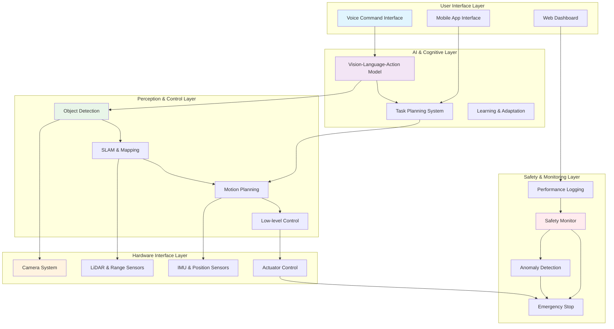

# Capstone Project

## Overview

The Capstone Project represents the culmination of the Physical AI & Humanoid Robotics curriculum, integrating all concepts, skills, and technologies covered throughout the course. Students work in teams to design, implement, and demonstrate a comprehensive Physical AI system that solves a real-world problem or demonstrates advanced robotics capabilities. This project serves as the primary assessment of student learning and provides a portfolio piece for future academic or professional endeavors.

The capstone project emphasizes innovation, technical excellence, safety, and real-world applicability. Students are expected to demonstrate mastery of multiple course modules including ROS2, simulation, NVIDIA Isaac, VLA models, hardware integration, and ethical considerations. Projects should showcase both technical proficiency and creative problem-solving abilities.

## Key Concepts

- **System Integration**: Combining multiple technologies and subsystems into a cohesive solution
- **Innovation**: Creative application of Physical AI concepts to solve novel problems
- **Real-World Application**: Addressing authentic challenges with practical solutions
- **Team Collaboration**: Working effectively in multidisciplinary teams
- **Technical Documentation**: Comprehensive documentation of design and implementation
- **Ethical Considerations**: Addressing societal implications of Physical AI systems
- **Project Management**: Planning, executing, and delivering complex projects

## Details

### Project Structure and Timeline

**Phase 1: Project Proposal and Planning (Weeks 1-2)**:
- Problem identification and research
- Literature review and competitive analysis
- Technical approach and architecture design
- Risk assessment and mitigation planning
- Resource requirements and timeline
- Safety and ethical considerations

**Phase 2: System Design and Architecture (Weeks 3-4)**:
- Detailed system architecture
- Component selection and procurement
- Interface design and communication protocols
- Safety system design
- Testing and validation plan

**Phase 3: Implementation and Integration (Weeks 5-8)**:
- Component development and testing
- System integration and debugging
- Iterative improvement and optimization
- Safety system implementation
- Performance evaluation

**Phase 4: Validation and Demonstration (Weeks 9-10)**:
- Comprehensive system testing
- Performance validation
- Safety verification
- Final demonstration and presentation
- Documentation and project handoff

### Project Requirements

**Technical Requirements**:
- Integration of at least 3 major course components (ROS2, simulation, NVIDIA Isaac, VLA, etc.)
- Real-time performance with appropriate response times
- Safety systems and emergency protocols
- Robust error handling and recovery
- Documentation of all code and design decisions

**Innovation Requirements**:
- Novel application or approach to existing problems
- Creative use of Physical AI technologies
- Potential for real-world impact
- Demonstration of learning beyond basic course content

**Safety and Ethics Requirements**:
- Comprehensive safety analysis and protocols
- Ethical considerations in design and implementation
- Privacy protection for any data collection
- Inclusive design principles
- Environmental impact considerations

### Evaluation Criteria

**Technical Excellence (40%)**:
- Correct implementation of core concepts
- System performance and efficiency
- Code quality and documentation
- Innovation and technical sophistication

**Integration Quality (25%)**:
- Successful integration of multiple components
- Robust system architecture
- Effective communication between subsystems
- Handling of edge cases and errors

**Innovation and Impact (20%)**:
- Novelty and creativity of solution
- Potential real-world application
- Addressing meaningful challenges
- Demonstrated learning beyond course requirements

**Presentation and Documentation (15%)**:
- Clear technical documentation
- Effective presentation of results
- Professional communication of concepts
- Comprehensive project portfolio

### Safety and Ethical Considerations

**Physical Safety**:
- Risk assessment for all physical interactions
- Emergency stop mechanisms and protocols
- Collision avoidance and force limiting
- Safe operation boundaries and constraints

**Data Privacy**:
- Protection of personal information
- Secure data handling and storage
- Informed consent for data collection
- Compliance with privacy regulations

**Ethical AI**:
- Fairness and bias considerations
- Transparency in AI decision-making
- Accountability for system behavior
- Respect for human autonomy and dignity

**Environmental Impact**:
- Sustainable design practices
- Energy efficiency considerations
- Responsible disposal of components
- Minimization of environmental footprint

### Project Support and Resources

**Mentorship**:
- Faculty advisors for technical guidance
- Industry mentors for real-world perspective
- Peer collaboration and feedback
- Regular check-ins and progress reviews

**Technical Resources**:
- Access to laboratory equipment and robots
- Software licenses and development tools
- Cloud computing resources when needed
- Technical documentation and references

**Project Management Tools**:
- Version control systems for code management
- Project tracking and collaboration platforms
- Documentation and presentation tools
- Testing and validation frameworks

## Examples

### Example 1: Capstone Project Ideas

**Assistive Robotics for Elderly Care**:
- Problem: Supporting independent living for elderly individuals
- Technology Integration: VLA models for understanding commands, manipulation for assistance tasks, navigation for mobility support
- Innovation: Personalized assistance based on individual needs and preferences
- Impact: Improved quality of life and reduced caregiver burden

**Warehouse Automation System**:
- Problem: Efficient and safe material handling in warehouses
- Technology Integration: ROS2 for system coordination, NVIDIA Isaac for perception, simulation for testing
- Innovation: Human-robot collaboration in shared spaces
- Impact: Increased efficiency and safety in logistics operations

**Educational Robot for STEM Learning**:
- Problem: Engaging students in STEM subjects through interactive robotics
- Technology Integration: VLA models for natural interaction, manipulation for hands-on activities
- Innovation: Adaptive teaching based on student engagement and learning patterns
- Impact: Improved STEM education outcomes

**Environmental Monitoring Robot**:
- Problem: Autonomous monitoring of environmental conditions
- Technology Integration: Sensor fusion, navigation in challenging terrain, data collection and analysis
- Innovation: Long-term autonomous operation in remote locations
- Impact: Better environmental monitoring and conservation efforts

### Example 2: Project Proposal Template

```
Capstone Project Proposal: [Project Title]

Team Members: [Names and roles]
Advisor: [Faculty advisor name]
Duration: 10 weeks (Semester-long project)

Problem Statement:
[1-2 paragraphs describing the problem to be solved and its significance]

Objectives:
1. Primary objective: [Specific, measurable goal]
2. Secondary objectives: [Additional goals to be achieved]
3. Learning objectives: [Skills and knowledge to be demonstrated]

Technical Approach:
- Hardware platform: [Robot platform, sensors, actuators]
- Software stack: [ROS2, simulation, AI frameworks, etc.]
- Architecture: [System design and component interactions]
- Methodology: [Development approach and validation plan]

Innovation Elements:
- Novel application of Physical AI technologies
- Creative problem-solving approach
- Potential for real-world impact

Risk Assessment:
- Technical risks: [Identified risks and mitigation strategies]
- Schedule risks: [Potential delays and contingency plans]
- Resource risks: [Equipment, software, or personnel constraints]

Expected Outcomes:
- Functional prototype demonstration
- Performance metrics and validation results
- Technical documentation and code repository
- Presentation and demonstration to stakeholders

Ethical and Safety Considerations:
- Safety protocols for system operation
- Ethical implications of the technology
- Privacy considerations for any data collection
- Environmental impact assessment
```

### Example 3: System Architecture for Capstone Project



### Example 4: Project Timeline and Milestones

**Week-by-Week Breakdown**:

| Week | Milestone | Deliverables | Success Criteria |
|------|-----------|--------------|------------------|
| 1 | Project Proposal | Proposal document, initial design | Clear problem definition, feasible approach |
| 2 | Architecture Design | System architecture, component selection | Well-defined interfaces, resource planning |
| 3 | Development Setup | Development environment, basic components | Working development pipeline |
| 4 | Component Development | Individual component implementation | Components meet specifications |
| 5 | Initial Integration | Basic system integration | Components communicate successfully |
| 6 | System Integration | Full system integration | End-to-end functionality |
| 7 | Optimization & Testing | Performance optimization | Meets performance targets |
| 8 | Safety & Validation | Safety systems, validation testing | Safe operation, validated performance |
| 9 | Final Testing | Comprehensive testing and refinement | System ready for demonstration |
| 10 | Demonstration | Final presentation and demo | Successful project demonstration |

### Example 5: Safety and Ethics Assessment

**Safety Risk Assessment Matrix**:

| Risk Category | Risk Level | Mitigation Strategy | Responsibility |
|---------------|------------|-------------------|----------------|
| Physical harm to users | High | Emergency stop, collision avoidance, force limiting | System designer |
| Data privacy breach | Medium | Encryption, access controls, consent | Software developer |
| System malfunction | Medium | Redundancy, error handling, monitoring | All team members |
| Environmental hazard | Low | Proper disposal, energy efficiency | Project manager |

**Ethical Considerations Checklist**:
- [ ] Fairness: System treats all users equitably
- [ ] Transparency: System behavior is explainable
- [ ] Privacy: User data is protected
- [ ] Safety: Physical and psychological safety ensured
- [ ] Accountability: Clear responsibility for system behavior
- [ ] Sustainability: Environmental impact minimized
- [ ] Accessibility: System usable by diverse populations

### Example 6: Evaluation Rubric

**Capstone Project Evaluation Rubric**

| Category | Excellent (4) | Proficient (3) | Developing (2) | Beginning (1) |
|----------|---------------|----------------|----------------|---------------|
| **Technical Implementation** | Sophisticated implementation with advanced features | Solid implementation meeting requirements | Basic implementation with some issues | Incomplete or non-functional |
| **System Integration** | Seamless integration of multiple complex components | Good integration of required components | Basic integration with some issues | Poor integration |
| **Innovation** | Highly innovative approach with significant originality | Innovative approach with creative elements | Some innovative elements | Minimal innovation |
| **Safety & Ethics** | Comprehensive safety and ethical considerations | Good safety and ethics implementation | Basic safety and ethics | Insufficient consideration |
| **Documentation** | Comprehensive, clear, and professional | Good documentation with minor gaps | Basic documentation | Poor or incomplete |
| **Presentation** | Excellent communication and demonstration | Good presentation and explanation | Adequate presentation | Poor presentation |

**Weighted Scoring**:
- Technical Implementation: 30%
- System Integration: 25%
- Innovation: 20%
- Safety & Ethics: 15%
- Documentation: 5%
- Presentation: 5%

The capstone project serves as the ultimate demonstration of student learning in Physical AI and Humanoid Robotics, requiring integration of all course concepts into a meaningful, innovative, and safe real-world application. This comprehensive project experience prepares students for advanced work in the field while showcasing their technical capabilities to future employers and academic institutions.